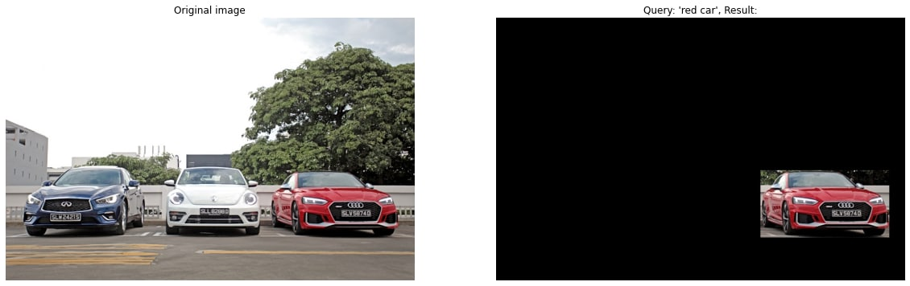

# clip_dataset_creator

Command line tool for labeled dataset creation with CLIP

## Usage example
```
python main.py --orig_dataset_folder images --query "red car" --output_folder dataset
```
## Metrics
TO DO

## Performance

## System requirements
* Nvidia GPU with minimum 8GB VRAM